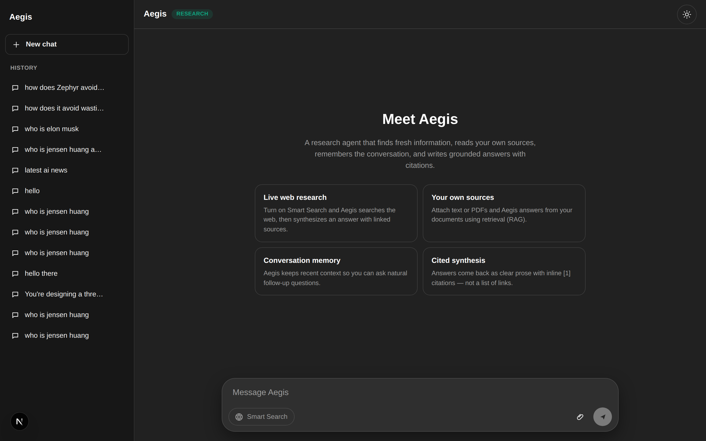
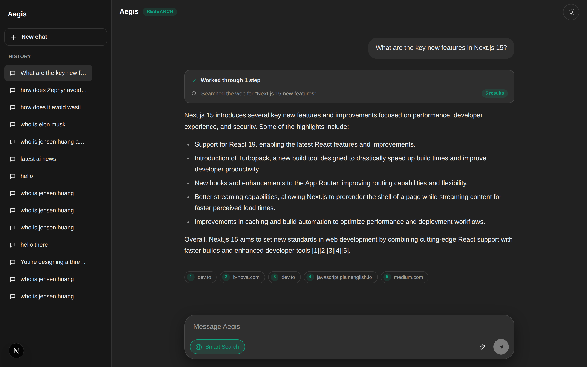
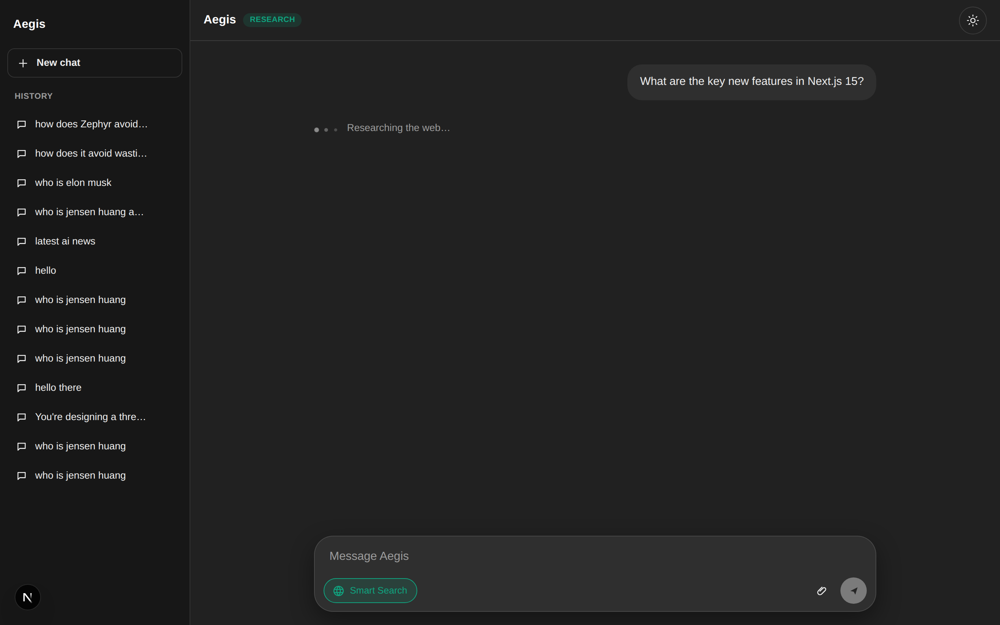
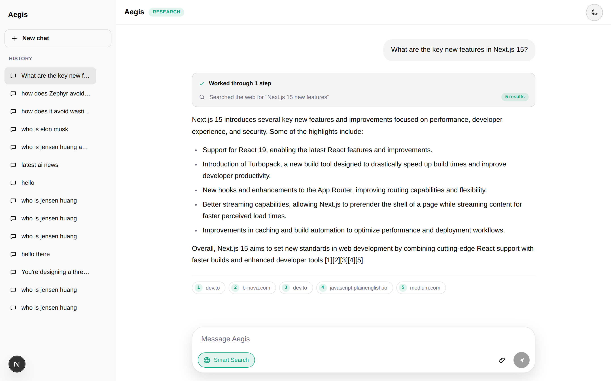

# Aegis Agent

Aegis is a **ReAct research agent**: it answers questions that need fresh information by autonomously deciding which tools to use, calling them in a multi-step reason → act → observe loop, and synthesizing a grounded, cited answer.

Ask it something and turn on **Smart Search** — the model itself decides what to search, runs the searches (often several, refining as it goes), reads the results, and writes a clear answer with inline `[1]` citations. The UI shows the agent's actual steps as it works.

## Demo


> The clip above shows a full turn: turning on Smart Search, asking a question, the agent searching the web, and a grounded answer with inline citations and source chips. A higher-quality [MP4 version](docs/media/aegis-demo.mp4) is also included.

### Screenshots

| Home | Answer with citations |
|---|---|
|  |  |

| Agent researching | Light theme |
|---|---|
|  |  |

## Highlights

- **Autonomous agent loop** — a true ReAct cycle over OpenAI function-calling. The model picks tools, can call them multiple times, observes results, and stops when it has enough to answer (capped at 5 iterations).
- **Tools** — `web_search` (live web via Tavily) and `search_knowledge` (RAG over the user's own documents).
- **Grounded synthesis** — answers are natural prose with inline citations, never a dump of raw snippets. Every tool call is recorded as a step trace.
- **Tiered memory** — recent-conversation buffer with a Redis → Postgres → in-memory degradation chain.
- **Graceful degradation** — every external service is optional. No key or a failed call falls back to a deterministic search-and-synthesize path; the app never hard-crashes on a missing integration.
- **Clean UI** — ChatGPT-style single-column chat with light/dark themes, a live "researching…" indicator, an agent-steps timeline, and source chips.

## Architecture

A Next.js 15 (App Router, React 19) single-page app. The browser talks to Route Handlers under `src/app/api/`; all agent logic runs server-side in `src/lib/`.

**Request flow** (`POST /api/chat` → [`runAgent`](src/lib/agent/index.ts)):

1. Load recent conversation memory.
2. Run the **ReAct loop** ([`runReactAgent`](src/lib/agent/index.ts)): the model reasons, calls tools, and observes numbered results until it writes a cited answer.
3. If OpenAI is unconfigured or errors, fall back to the deterministic path ([`runFallback`](src/lib/agent/index.ts) + `synthesizeLocally`).
4. Persist messages, the run (with its step trace and citations), and a conversation summary.

**Three-layer persistence pattern** — Memory, DB, and RAG each pair a real backend with an in-process `globalThis` fallback ([runtime-store.ts](src/lib/runtime-store.ts)):

- **Memory** ([src/lib/memory](src/lib/memory/index.ts)) — Redis (`aegis:session:*`), falling back to the runtime store, with reads able to fall through to Postgres. Recent window: 5 messages.
- **Database** ([src/lib/db](src/lib/db/index.ts)) — Postgres via `pg`; schema is auto-created lazily (no migration step). No `DATABASE_URL` → returns runtime-store data.
- **RAG** ([src/lib/rag](src/lib/rag/index.ts)) — semantic retrieval with **pgvector**: documents (text/PDF) are chunked, embedded with OpenAI `text-embedding-3-small`, stored as `vector(1536)` in Postgres, and queried by cosine similarity (HNSW index). Falls back to in-memory token-overlap scoring when Postgres or embeddings are unavailable.

## API

| Route | Purpose |
|---|---|
| `POST /api/chat` | Main agent turn (needs `sessionId` + `message`; `useWebSearch` toggles the web tool) |
| `GET /api/conversations` | List conversation summaries |
| `GET\|DELETE /api/conversations/[sessionId]` | Load full history / delete from all stores |
| `GET\|POST /api/sources` | List / add a text knowledge document |
| `POST /api/sources/pdf` | Upload up to 3 PDFs (text extracted via `pdfjs-dist`) |
| `GET /api/health` | Liveness |

## Tech stack

TypeScript · Next.js 15 · React 19 · Tailwind CSS · OpenAI (Chat Completions function-calling) · Tavily · Redis · PostgreSQL (`pg`) · `pdfjs-dist`.

## Getting started

```bash
npm install
npm run dev      # http://localhost:3000
```

Other commands: `npm run build`, `npm run start`, `npm run lint`.

### Environment

All integrations are optional and read from `.env.local` (centralized in [src/lib/env.ts](src/lib/env.ts)). Without them, Aegis runs on its in-memory fallbacks.

| Variable | Used by | Default |
|---|---|---|
| `OPENAI_API_KEY` | the ReAct agent (required for true agent behavior) | — |
| `OPENAI_MODEL` | model selection | `gpt-4.1-mini` |
| `TAVILY_API_KEY` | `web_search` tool | — |
| `REDIS_URL` | short-term memory | — |
| `DATABASE_URL` | Postgres persistence | — |

> Without a valid `OPENAI_API_KEY`, Aegis still responds — but via the deterministic fallback, not the autonomous ReAct loop.

## Roadmap

- Streaming the agent's steps and answer token-by-token
- Tracing/observability (Langfuse) and a small evaluation harness
- Reranking retrieved chunks and richer chunking (sentence-aware)
