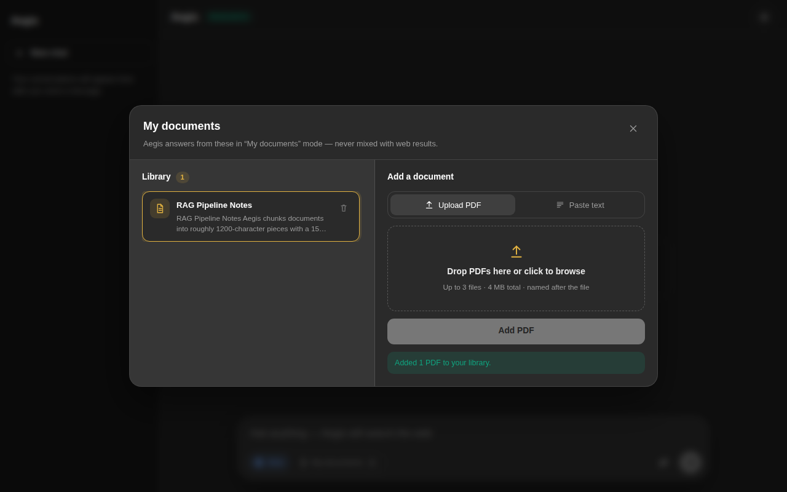
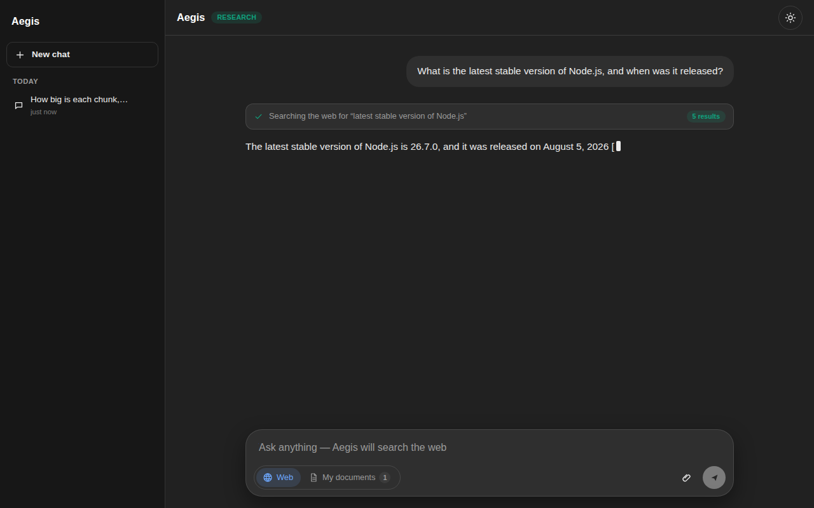
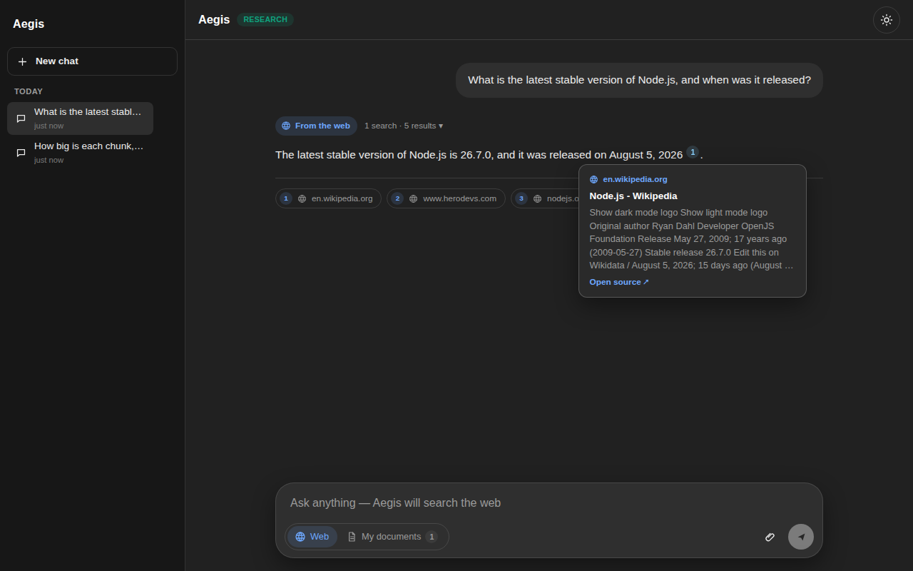
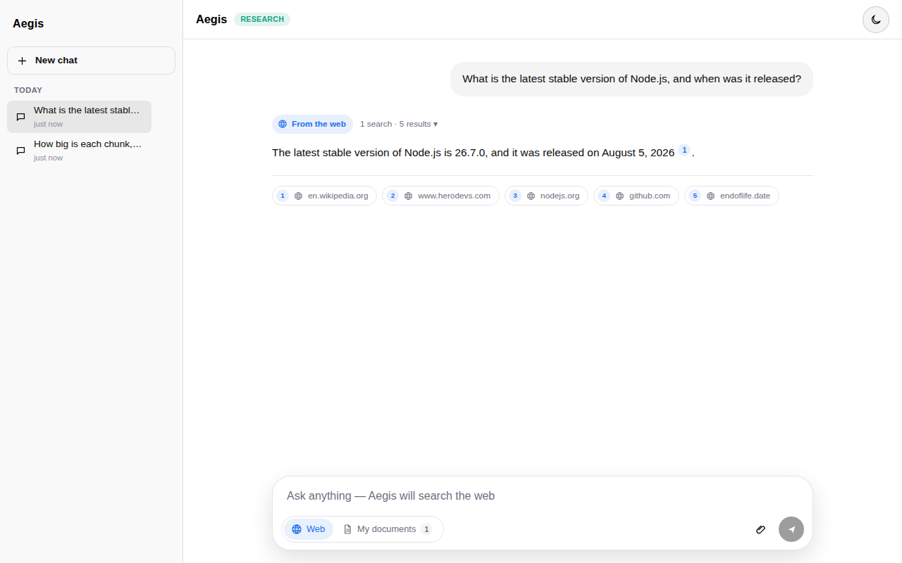

# Aegis Agent

Aegis is a **ReAct research agent** that answers from one of two places you choose: the **live web** or **your own documents**, never both at once. It decides which searches to run, runs them (often several, refining as it goes), and streams back a grounded answer where every claim carries a clickable citation.

**Live demo:** [aegis-agent-zeta.vercel.app](https://aegis-agent-zeta.vercel.app)

## Demo


*Silent GIF preview above. For the full-quality video with narration, see [docs/media/aegis-demo.mp4](docs/media/aegis-demo.mp4).*

> The clip shows both modes back to back. First, a PDF is uploaded into the private library, the switch goes to **My documents**, and a question is answered only from that PDF: live search steps, a streamed answer, and a citation card showing the exact passage. Then the switch goes to **Web** for a live question researched on the internet, with a cited source behind the answer.

### Screenshots

| Home: pick where Aegis looks | Private document library |
|---|---|
|  |  |

| Answer streaming with live steps | Citation preview |
|---|---|
|  |  |



## Highlights

- **Autonomous agent loop.** A real ReAct cycle over OpenAI function calling: the model picks its tools, can call them several times, observes the results, and stops when it has enough evidence (capped at 5 iterations).
- **Two exclusive modes.** *Web* gives the agent only `web_search` (Tavily); *My documents* gives it only `search_knowledge` (RAG over your uploads). The mode is recorded on every answer, so each answer is labeled with where it came from.
- **Streaming.** The agent's progress ("Searching the web for …", result counts) and the answer text stream to the browser as they happen, over newline-delimited JSON.
- **Clickable citations.** Inline `[n]` markers become badges; hovering or tapping one shows the source's title, site or document, and the passage that was cited.
- **Private per-browser workspaces.** Each browser gets an anonymous workspace. Documents are stored and searched per workspace, and a conversation can only be read, continued or deleted by the workspace that started it.
- **Rate limiting.** Per-IP limits on chat, uploads and deletes (Redis fixed windows, returning `429` with `Retry-After`), so a public deployment can't be used to run up the API bill.
- **Graceful degradation.** Every external service is optional. A missing key or failed call falls back to a deterministic path; `/api/health` reports whether Redis and Postgres are actually reachable.
- **Measured, not just demoed.** A Braintrust eval suite with custom scorers; see [Evaluation](#evaluation).

## Architecture

A Next.js 15 (App Router, React 19) app. The browser talks to Route Handlers under `src/app/api/`; all agent logic runs server-side in `src/lib/`.

**Request flow** (`POST /api/chat` → [`runAgent`](src/lib/agent/index.ts)):

1. Check the workspace and rate limit ([src/lib/api.ts](src/lib/api.ts)), and make sure the session belongs to this workspace ([src/lib/session-access.ts](src/lib/session-access.ts)).
2. Load recent conversation memory.
3. Run the **ReAct loop** ([`runReactAgent`](src/lib/agent/index.ts)) with only the chosen mode's tool. Each tool call and each piece of answer text is emitted as a stream event.
4. If OpenAI is unconfigured or errors, fall back to a deterministic search-and-excerpt path.
5. Persist the messages, the run (with its step trace and citations) and a conversation summary.

**Three-layer persistence.** Memory, database and RAG each pair a real backend with an in-process fallback ([runtime-store.ts](src/lib/runtime-store.ts)):

- **Memory** ([src/lib/memory](src/lib/memory/index.ts)): Redis, with reads falling through to Postgres. The history list merges both, so a conversation is never lost if one store misses a write.
- **Database** ([src/lib/db](src/lib/db/index.ts)): Postgres via `pg`; the schema is created and migrated lazily (no migration step).
- **RAG** ([src/lib/rag](src/lib/rag/index.ts)): text and PDFs are chunked (~1200 characters, 150 overlap), embedded with OpenAI `text-embedding-3-small`, and stored as `vector(1536)` in **pgvector**. Search filters to the workspace first, then ranks by exact cosine distance, so small workspaces aren't starved by approximate-index post-filtering. Falls back to in-memory keyword scoring without Postgres.

## API

Every route except `/api/health` needs an `x-aegis-workspace` header (the browser sends it automatically).

| Route | Purpose |
|---|---|
| `POST /api/chat` | Agent turn (`sessionId`, `message`, `useWebSearch`). Streams events with `Accept: application/x-ndjson`, otherwise returns JSON |
| `GET /api/conversations` | This workspace's conversations |
| `GET\|DELETE /api/conversations/[sessionId]` | Load a conversation (every answer with its own sources) / delete it |
| `GET\|POST /api/sources` | List / add a text document |
| `DELETE /api/sources/[sourceId]` | Remove a document |
| `POST /api/sources/pdf` | Upload up to 3 PDFs (under 4 MB total) |
| `POST /api/brief` | Structured four-section brief over your documents (API only) |
| `POST /api/workspace/claim` | One-time move of conversations created before workspaces |
| `GET /api/health` | Liveness plus Redis / Postgres reachability |

## Tech stack

TypeScript · Next.js 15 · React 19 · OpenAI (Chat Completions function calling, streaming) · Tavily · PostgreSQL + pgvector · Redis · `pdfjs-dist` · Braintrust · deployed on Vercel.

## Getting started

```bash
npm install
npm run dev      # http://localhost:3000
```

Other commands:

| Command | What it does |
|---|---|
| `npm test` | Unit tests for the pure logic (streaming parser, rate limiter, workspace isolation, history, chunking, eval scorers) |
| `npm run lint` | ESLint |
| `npm run build` / `npm run start` | Production build / serve it |
| `npm run typecheck:tools` | Type-checks `evals/` and `scripts/` (kept out of the Next build) |

### Environment

All integrations are optional and read from `.env.local` (centralized in [src/lib/env.ts](src/lib/env.ts)).

| Variable | Used by | Default |
|---|---|---|
| `OPENAI_API_KEY` | the ReAct agent and embeddings | — |
| `OPENAI_MODEL` | model selection | `gpt-4.1-mini` |
| `TAVILY_API_KEY` | `web_search` tool | — |
| `DATABASE_URL` | Postgres + pgvector (conversations, documents) | — |
| `REDIS_URL` | memory and rate limits | — |
| `BRAINTRUST_API_KEY` | trace spans and the eval harness | — |
| `BRAINTRUST_PROJECT` | Braintrust project name | `aegis-agent-eval` |

> Without `OPENAI_API_KEY`, Aegis still answers, but through the deterministic fallback rather than the agent loop. Without `DATABASE_URL` or `REDIS_URL`, it keeps state in memory, which on serverless hosting doesn't survive between requests.

### Deploying to Vercel

1. Import the repository in Vercel (the Next.js defaults are correct).
2. Add the environment variables above for Production and Preview.
3. Deploy, then check `/api/health`: `checks.redis` and `checks.postgres` should both be `"ok"`.

PDF extraction needs `pdfjs-dist`'s worker and the native `@napi-rs/canvas` binary; [next.config.ts](next.config.ts) includes both in the serverless bundle explicitly, because file tracing can't see how they're loaded.

## Evaluation

The document workflow is covered by a **Braintrust evaluation harness**.

```bash
npm run seed:knowledge   # ingest the demo document (NIST AI RMF 1.0 PDF) into the shared demo workspace
npm test                 # pure-logic unit tests
npm run eval             # full Braintrust run (needs BRAINTRUST_API_KEY)
```

- **Dataset** ([evals/dataset.ts](evals/dataset.ts)): 18 cases against the real NIST AI Risk Management Framework 1.0 PDF: 6 direct factual, 5 multi-hop, 3 "not in the document" (should be declined, not hallucinated), and 4 brief requests. Cases pinned from a real past failure carry a `"regression"` tag.
- **Scorers** ([evals/scorers.ts](evals/scorers.ts)): two LLM-graded, `Factuality` (via `autoevals`) and `NoHallucination` (did the agent decline, or make something up?); plus three programmatic, `CitationValidity` (every `[n]` resolves to a retrieved source), `Completeness` (all four brief sections present) and `SearchTrajectory` (multi-hop cases should show real search refinement).
- **Suite** ([evals/agent.eval.ts](evals/agent.eval.ts)): two Braintrust experiments, one per workflow, calling `runReactAgent` / `runBriefAgent` directly.

**[docs/eval-findings.md](docs/eval-findings.md)** writes up what the baseline run surfaced: a retrieval bug that fed the model a document's title page instead of the retrieved chunks (chat Factuality 37.14% → 58.57%), why `CitationValidity` stayed at a perfect 100% the whole time it was broken, and why `SearchTrajectory` *dropped* once retrieval started working.

The four-section brief (`POST /api/brief`, [`runBriefAgent`](src/lib/agent/brief.ts)) uses the same loop with a stricter output contract: exactly **Overview**, **Key Findings**, **Gaps & Limitations** and **Conclusion**, parsed back into typed sections by [`parseBriefSections`](src/lib/agent/brief-sections.ts) so a missing heading is a detectable failure.

## Regenerating the demo

The video, GIF and screenshots above are a real Playwright recording of the app, narrated with Piper TTS. See [scripts/demo/README.md](scripts/demo/README.md).

## Roadmap

- Streaming answers — **done**
- Evaluation harness — **done**, see [docs/eval-findings.md](docs/eval-findings.md)
- Hybrid retrieval (vector + keyword) with reranking, and sentence-aware chunking
- Copy / regenerate / feedback on answers, logged to Braintrust to close the loop with the evals
